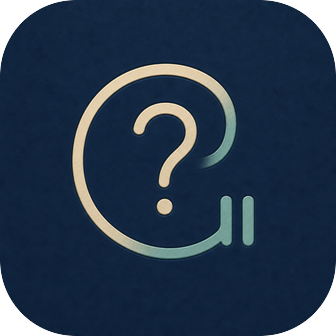
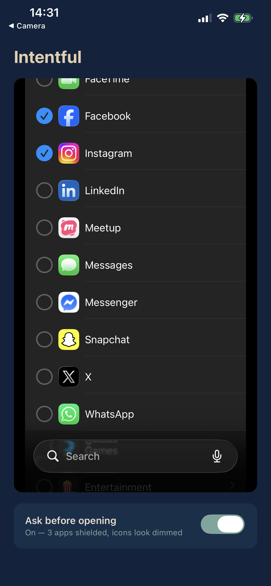
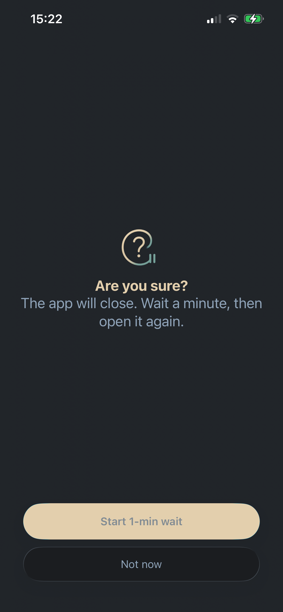
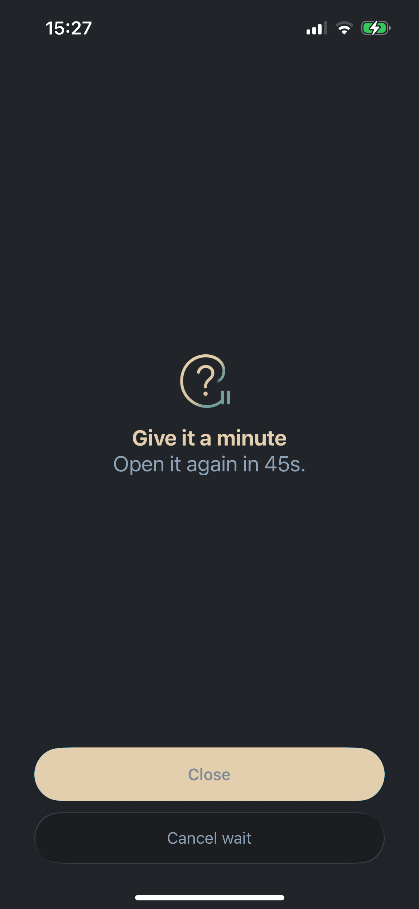
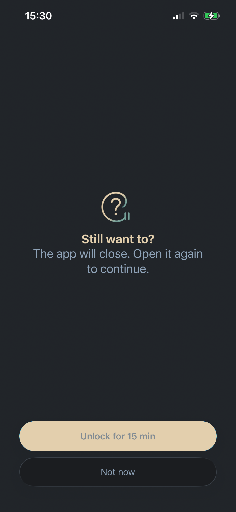

<p align="center">
  <a href="#"></a>
</p>

<h1 align="center">Intentful</h1>

<p align="center">
  <strong>One question before the apps you open without thinking: are you sure?</strong>
</p>

<p align="center">
  Pick the apps. Opening one shows a shield instead.<br>
  Say yes, wait a minute, and it's yours for fifteen. Say no, and it just closes.<br>
  No streaks, no scores, no account. Nothing leaves your iPhone.
</p>

<p align="center">
  <a href="https://apps.apple.com/app/id6761717073"></a>
  <a href="LICENSE"></a>
  
  
  
  <a href="PRIVACY.md"></a>
</p>

<p align="center">
  <a href="#how-it-works">How it works</a> ·
  <a href="#requirements">Requirements</a> ·
  <a href="#building-it-yourself">Build it</a> ·
  <a href="#layout">Layout</a> ·
  <a href="SUPPORT.md">Support</a> ·
  <a href="PRIVACY.md">Privacy</a>
</p>

<p align="center">
  
  &nbsp;
  
  &nbsp;
  
  &nbsp;
  
</p>

<br>

> **Who it is for**
>
> - **You open some apps on reflex** and want a moment to notice before you're in.
> - **You've tried hard limits** and switched them off the first time they got in the way. Intentful never refuses; it only asks, and makes you wait a minute.
> - **You want it to stay on your phone.** No account, no server, no analytics — and the source is here to check.

## How it works

Apple's Screen Time APIs can only trigger on *cumulative minutes of use*, never
on an app being opened. So Intentful doesn't use thresholds at all — it applies
a shield to your selected apps and leaves it there. A permanently shielded app
shows the shield every time you open it, which is exactly the prompt we want.

The first **Yes** records the time and closes the app. Reopened within the
minute, the shield counts down and **Yes** does nothing. Once the minute is up
the shield offers **Unlock for 15 min** for five minutes, after which the wait
starts over. While waiting, **Not now** becomes **Cancel wait**.

Tapping **Unlock for 15 min** exempts that one app from the shield and schedules
a one-off 15-minute `DeviceActivity` interval. When that interval ends, the
monitor extension drops the exemption and the app asks again.

The shield closes the app rather than revealing it, so you reopen it yourself.

One thing about that window is worth knowing, because it surprises people: it
runs on the clock whether you use the app or not. Your other chosen apps are
unaffected and keep asking.

Fifteen minutes is Apple's minimum schedule length, not a design choice.

## Requirements

- A **physical iPhone** — Screen Time APIs do not exist in the Simulator
- Xcode with your Apple ID signed in (Xcode › Settings › Accounts)
- An Apple Developer account
- iOS 16+

## Building it yourself

```bash
npm install
APPLE_TEAM_ID=YOURTEAM BUNDLE_ID=com.you.intentful APP_GROUP=group.you.intentful \
  npm run build
```

`APPLE_TEAM_ID` is required and has no default — the build fails with a clear
message without it. `BUNDLE_ID` and `APP_GROUP` fall back to this project's own
identifiers, which are registered to someone else's team, so set your own.
Putting them in `.env.local` works too; that file is gitignored.

`npm run build` prebuilds the iOS project, compiles with `xcodebuild`, and
installs onto the connected device. `npm run dev` starts the dev server on the
local network, which is what lets the dev client find it automatically. If the
phone and Mac are on different networks, use `npm run dev -- --tunnel` and enter
the URL by hand.

### Apple setup

Register these four App IDs in the developer portal, each with **Family
Controls** and **App Groups** capabilities, plus one App Group:

```
com.you.intentful
com.you.intentful.ActivityMonitorExtension
com.you.intentful.ShieldConfiguration
com.you.intentful.ShieldAction
```

The **Family Controls (Development)** capability is self-serve — tick it and it
works. Shipping to TestFlight or the App Store additionally requires the
**Family Controls (Distribution)** entitlement, which is
[requested from Apple](https://developer.apple.com/contact/request/family-controls-distribution)
and reviewed manually. The request is a short form and the grant is assigned to
your whole account, not to one bundle ID — but you then have to enable it under
*Additional Capabilities* on each of the four identifiers, which is not the same
checkbox as the development one.

## Layout

```
app/
  _layout.tsx        Stack, nothing else
  index.tsx          the only screen: app picker + on/off
lib/
  colors.ts          palette, sampled from the app icon
  constants.ts       selection id, re-arm window
  device-activity.ts Screen Time authorization
  monitoring.ts      arm() / disarm()
  shield-config.ts   the "Are you sure?" shield and its two buttons
plugins/
  withAutoSigning.js sets automatic signing on all four targets
targets/             the three extensions, forked from react-native-device-activity
```

## Credits

Built on [react-native-device-activity](https://github.com/kingstinct/react-native-device-activity)
by Kingstinct, which does the hard work of exposing Apple's Screen Time APIs to
React Native.
